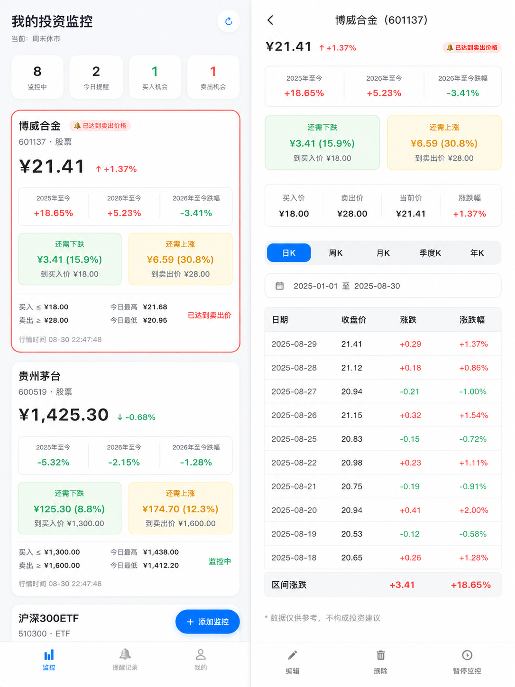
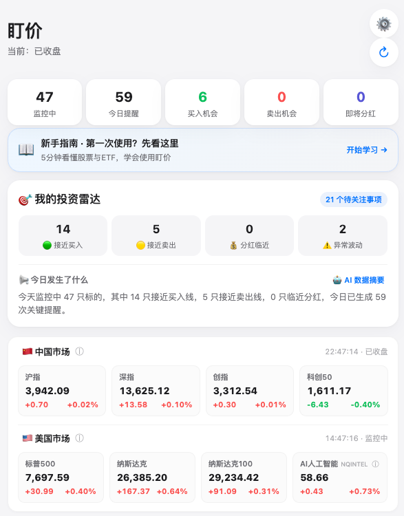
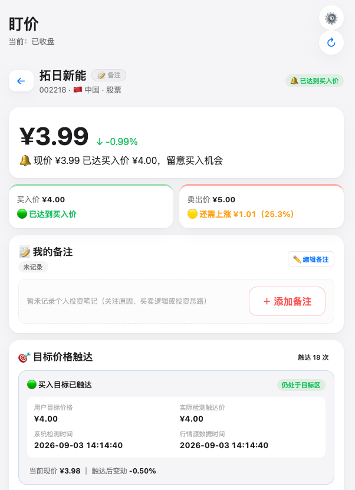

# 盯价
> 你定价格，我来盯。

盯价是一款面向中国 A 股和美股个人投资者的投资监控工具，帮助用户管理股票、ETF、目标价格、持仓、资产、盈亏、分红和价格提醒。

## 功能介绍

1. **跨市场股票与 ETF 监控**
   - 🇨🇳 中国 A 股 + 中国 ETF
   - 🇺🇸 美股 + 美股 ETF
   - 买入 / 卖出目标价格设定
   - 价格触达检测与历史记录

2. **微信价格提醒**
   - 微信公众平台模板消息直推（主）
   - Server酱 / PushPlus / 企业微信机器人（备用）

3. **资产管理与持仓盈亏**
   - 多币种（CNY / USD）持仓跟踪
   - 浮动盈亏实时计算
   - 持仓集中度分析
   - 批量导入持仓

4. **交易模拟器**
   - 补仓模拟器（推演追加后均价变化）
   - 卖出模拟器（推演理论利润）
   - 9 档情景盈亏测算表（-30% ~ +30%）

5. **分红雷达**
   - A 股分红事件追踪
   - 股权登记日倒计时
   - 预计现金分红计算

6. **市场与基本面数据**
   - 中美 8 大核心指数大盘概览
   - 52 周最高 / 最低价
   - PE / PB / ROE 估值看板
   - 历史 K 线行情（日/周/月/季度/年）

7. **其他**
   - 投资备注 / 复盘日记
   - 投资计划与多档网格买卖点
   - 批量导入监控标的
   - 12 节新手指南
   - AI 大盘每日收评与持仓归因
<p align="center">
  
</p>

<p align="center">
  
  
</p>
<p align="center"><em>左：投资雷达与中美核心指数看板 ｜ 右：标的监控与买入目标价触达</em></p>

## 数据来源
| 市场 | 数据源 | 说明 |
|---|---|---|
| 🇨🇳 中国 A 股 / ETF | 同花顺金融数据开放平台 | 行情快照（非逐笔高频） |
| 🇺🇸 美股 / 美股 ETF | 腾讯财经美股通道（Yahoo Finance 指数/备用） | 官方快照（提取美东真实交易时刻） |

## 🔔 价格监控与推送机制

盯价通过云端轻量定时哨兵（`ths-check-market`）实现全天候跨市场监控与精准触达：

### 1. 智能交易时钟（自动唤醒与休眠）
- **A 股 / 中国 ETF**：匹配北京时间交易时段（09:15–11:30，13:00–15:00），盘中定期轮询快照；
- **美股 / 美股 ETF**：自适应美股交易时段（美东时间 09:30–16:00，自动识别夏令时与冬令时）；
- **休市保护**：午间休市、夜间无交易、周末与法定节假日自动进入静默休眠期，不发起冗余请求。

### 2. 价格触达判定与防骚扰机制
- **买入触达**：当前价格 ≤ 用户设定的买入目标价时触发；
- **卖出触达**：当前价格 ≥ 用户设定的卖出目标价时触发；
- **单次触发与重置（Rearm）**：触达后立即记录一条触达历史并下发通知，监控状态切换为“已达标”。在用户重新调整目标价格或手动重新武装前，**不会重复轰炸推送**，彻底避免行情在临界点反复震荡带来的通知骚扰。

### 3. 多渠道推送分发
- 📱 **微信公众平台模板消息（首选推荐）**：支持微信服务号 / 微信测试号官方直连，下发结构化卡片通知（包含股票名称、最新价、目标价、触达时间），点击卡片可一键跳转至 Web 监控面板；
- 🔄 **多平台备用通道**：无缝兼容 **Server酱 (Turbo)**、**PushPlus** 与 **企业微信群机器人 (Webhook)**，只需在环境变量中配置对应 Token 即可自动启用。

## 产品理念
盯价不预测市场。

用户自己制定：买入价格、卖出价格、投资计划。

盯价负责：监控、记录、计算、提醒。

最终投资决定由用户自己完成。

## 项目结构
```text
.
├── .env.example                     # 环境变量配置模板
├── .gitignore                       # Git 忽略配置
├── CHANGELOG.md                     # 版本更新日志
├── LICENSE                          # MIT 开源许可证
├── README.md                        # 项目说明文档
├── cloudbaserc.example.json         # 腾讯云开发部署配置模板
├── docs/                            # 开发与架构文档
│   ├── images/                      # 截图与图片资源
│   ├── lessons-learned.md           # 踩坑复盘与开发规范
│   ├── development-log/             # 每日迭代开发日志
│   └── snapshot/                    # 系统状态与架构快照
├── web/                             # 纯原生 Web 前端应用（零构建依赖）
│   ├── index.html                   # SPA 主页面（含 12 节新手指南）
│   ├── css/style.css                # Apple 风格响应式样式
│   ├── js/app.js                    # 前端核心业务逻辑
│   └── vendor/cloudbase.js           # 腾讯云开发 JS-SDK
└── cloudfunctions/                  # 26 个 CloudBase Serverless 微服务云函数
    ├── ths-check-market/            # 核心巡检：价格触达检测 + 微信推送
    ├── ths-get-market-overview/     # 中美 8 大核心指数
    ├── ths-get-portfolio/           # 多币种资产看板与盈亏测算
    ├── ths-get-market-price/        # 行情快照获取
    ├── ths-get-fundamentals/        # PE / PB / ROE 基本面
    ├── ths-get-history/             # 历史 K 线 + 52 周区间
    ├── ths-get-dividends/           # A 股分红雷达
    ├── ths-get-price-touches/       # 价格触达历史记录
    ├── ths-ack-price-touch/         # 确认价格触达提醒
    ├── ths-get-watches/             # 监控列表查询
    ├── ths-create-watch/            # 添加监控标的
    ├── ths-update-watch/            # 修改目标价格
    ├── ths-delete-watch/            # 删除监控标的
    ├── ths-import-watches/          # 批量导入监控
    ├── ths-create-holding/          # 录入持仓
    ├── ths-update-holding/          # 更新持仓
    ├── ths-delete-holding/          # 删除持仓
    ├── ths-import-holdings/         # 批量导入持仓
    ├── ths-get-alerts/              # 提醒历史列表
    ├── ths-update-account/          # 更新账户配置
    ├── ths-get-plans/               # 投资计划查询
    ├── ths-update-plan/             # 更新投资计划
    ├── ths-get-notes/               # 投资复盘日记
    ├── ths-create-note/             # 新增复盘日记
    ├── ths-delete-note/             # 删除复盘日记
    └── ths-get-ai-summary/          # AI 大盘收评与持仓归因
```

## 本地运行与部署
前端是纯原生 HTML5 + CSS3 + ES6+ JavaScript 的 SPA，零构建依赖，无需 npm install 或 webpack 打包。

配置与部署步骤：
1. 复制 `cloudbaserc.example.json` 为 `cloudbaserc.json` 并填写你的环境 ID 和密钥（仅供本地部署，已加入 .gitignore）
2. 复制 `.env.example` 为 `.env` 并填写配置
3. 复制 `web/config.example.js` 为 `web/config.js` 并填入你的 CloudBase `envId` 和 `accessKey`
4. 部署云函数：`tcb fn deploy`
5. 安全部署前端静态页面（必须部署到独占子目录 `ths`）：
   ```bash
   bash scripts/deploy-hosting.sh
   # 或手动指定环境部署到 /ths/ 路径：
   # npx tcb hosting deploy ./web ths -e <你的环境ID>
   ```

## 环境变量
| 变量名 | 必填 | 说明 |
|---|---|---|
| THS_API_KEY | 是（监控中国市场时） | 同花顺开放平台 API Key |
| THS_APP_URL | 否 | 监控 Web 应用线上访问地址（微信推送卡片跳转目标，默认自动匹配 /ths/） |
| THS_WECHAT_MP_APPID | 否 | 微信公众号 AppID |
| THS_WECHAT_MP_SECRET | 否 | 微信公众号 AppSecret |
| THS_WECHAT_MP_TEMPLATE_ID | 否 | 微信模板消息 ID |
| THS_WECHAT_MP_OPENID | 否 | 接收推送的微信 OpenID |
| THS_SERVERCHAN_KEY | 否 | Server酱 SendKey |
| THS_PUSHPLUS_TOKEN | 否 | PushPlus Token |
| THS_WECOM_WEBHOOK | 否 | 企业微信机器人 Webhook |

## 部署说明
当前项目部署于 Tencent CloudBase (Serverless)。

说明：
- 云函数部署：`tcb fn deploy`
- 前端部署：`tcb hosting deploy ./web <路径> -e <环境ID>`
- 数据库：CloudBase NoSQL 文档数据库

## 移动端体验
建议在 iPhone / Android 手机浏览器中打开，点击底部分享按钮选择「添加到主屏幕」，即可获得类似原生 App 的全屏沉浸式体验。

## 免责声明
盯价提供行情、资产、分红及相关数据整理与提醒功能，仅供个人投资管理和信息参考，不构成投资建议或收益保证。

具体行情及相关信息以交易所、上市公司及数据源最终披露为准。

## License
MIT License
